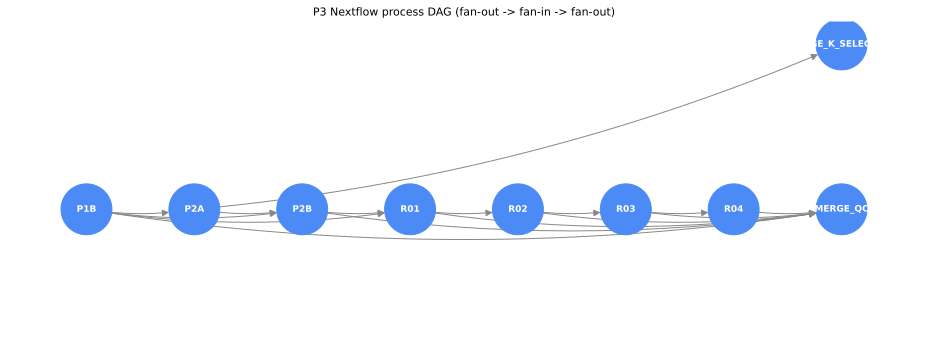

# mben-density-nf

[](https://github.com/sSanxiao/mben-density-nf/actions/workflows/ci.yml)

细胞密度耦合基因标签分析流程（Nextflow 实现）——MSc 论文（空间转录组 / 髓母细胞瘤）
的可复现重构。

## 这条流程做什么



per-sample 扇出 → per-dataset 扇入 → per-sample 扇出的三级结构：每个样本独立跑
`P1B → P2B → R01 → R02 → R03 → R04`，dataset 级在 `P2A` 汇总选 K，最后合并 QC 与 K 选择表。
三个 profile（`standard` / `docker` / `test`）的取舍见 `docs/NEXTFLOW_NOTES.md` §3。

## 怎么跑

```bash
nextflow run main.nf -profile test,docker   # 最快入口：3 样本 / 27 任务 / 容器
nextflow run main.nf -profile docker        # 全量 / 容器
nextflow run main.nf -profile standard      # 全量 / 无容器（服务器）
```

`docker` profile 拉取两个不可变标签的 GHCR 镜像（`thesis-python:3.7.10-*` /
`thesis-r:4.2.0-*`）；`standard` 不依赖容器，是服务器（Docker 1.13.1 无 daemon 权限）
的唯一选择。

## 可复现性是怎么保证的

**(a) 环境锁定。** R 依赖由 `env/renv.lock` 全量锁定（145 个包），Python 依赖由
`env/requirements.txt` 锁定（7 个包）；镜像基底钉死版本标签与 RSPM 快照日期，镜像内含
`build_info.txt` 与 LABEL 溯源。镜像由 CI 构建而非本机——「在我电脑上 build 的」不算可复现。

**(b) 两级等价标准。** 这是本流程最有分量的判断——区分位等价与浮点等价，并分别定义标准：

| 场景 | 标准 | 结果 |
|---|---|---|
| 同机重构前后 | 内容指纹**逐字节相同** | 服务器验收 A–F **6/6 通过** |
| Nextflow vs 直接调用（同容器） | 逐值相同 | **63 文件 exact match，numeric delta = 0** |
| 容器 vs 原生（跨 BLAS） | 数值容差（\|Δρ\| < 1e-6；计数精确；基因集合与分类标签相同） | 基因集合与标签完全一致 |

**(c) 指纹机制。** 不能直接比字节——`.rds` 内嵌时间戳；因此对易变列（耗时、文件大小）
显式排除，且排除集本身可审计；列类型由**内容**判定而非读取端推断（pandas 与
`data.table::fread` 对全 NA 列的推断不同）。

**(d) `-resume` 是真的。** 给 R03 加一行注释，35 个任务中 25 个 cached，只重算
`R03×4 + R04×4 + MERGE_QC×2`。这是「真 Nextflow」的直接证据，不是「跑通了」。

## 这套验证抓到了什么

不写「我配置了 CI」，写「CI 抓到了这五类只有真跑才暴露的问题」。五条均为构建/验证
过程中**实际发生**的真实缺陷：

| # | 类别 | 具体 |
|---|---|---|
| 1 | 文件生命周期 | 拆层后 `rm -rf /tmp/*` 删掉了需跨层存活的 lockfile |
| 2 | API 语义 | `install.packages(version=)` 无此形参，实参被 `...` 静默吞掉，版本 pin 从未生效 |
| 3 | 类型语义 | `packageVersion()` 返回版本对象，误用字符串比较导致 `1.6.4` ≠ `1.6-4` |
| 4 | 跨语言常量漂移 | `fingerprint.R` 的常量镜像与 `qc_schema.py` 失同步；本机因验证入口选错而从未跑到该检查 |
| 5 | 管道边缘条件 | `sed` 剥版本号时未滤注释行，pip 收到 `#` 作包名 |

共同点：五条的代码在语法与逻辑上都**完全正确，只有真正执行一次才会暴露**。

**对照实验（X 项，与上述五条分开）**：人为把 R03 的输出文件名改错一个字母，确认
CI 变红。该缺陷是**沉默型**——R 脚本 `exit status: 0`、正常打印完整汇总，是 Nextflow
的输出契约捕获了它。一个永远绿的 CI 与没有 CI 等价，所以必须证明它在该红的时候会红。

**能力边界（如实）**：本次根因定位实际依赖 job 日志；artifact 因 `upload-artifact`
默认不匹配点开头文件而未包含 `.nextflow.log` 与 `.command.err`，「artifact 可独立定位」
这一条**当前不成立**，已列入待办。这段诚实的边界声明不削弱说服力，反而增强。

## 已知限制

（E2 补齐）

## 仓库结构 / 文档索引

（E2 补齐）

原始论文代码存档：https://github.com/sSanxiao/Thesis_project